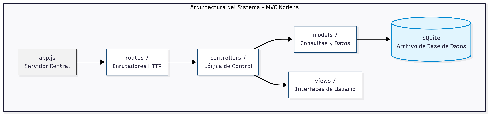

# 🛠️ Manual Técnico y Arquitectura del Sistema

Este documento detalla los aspectos tecnológicos, arquitectónicos y de datos que componen la plataforma.

---

## 1. Arquitectura de Red y del Sistema
La plataforma utiliza un modelo cliente-servidor clásico, donde el frontend interactúa mediante peticiones HTTP/HTTPS hacia un servidor desarrollado en **Node.js con Express**, el cual gestiona la lógica de negocio y se conecta de manera segura a la base de datos.

---

## 2. Modelo de Base de Datos
El sistema utiliza **PostgreSQL** como motor de base de datos relacional. El diseño asegura la integridad referencial entre las entidades de usuarios, roles, perfiles y servicios.

---

## 3. Estructura del Código Fuente
El backend está organizado de forma modular para facilitar su escalabilidad:

* **`controllers/`**: Contiene la lógica de las funciones que responden a cada solicitud.
* **`db/`**: Archivos de conexión y configuración con PostgreSQL.
* **`routes/`**: Define los endpoints y rutas accesibles de la API.
* **`public/`**: Archivos estáticos e interfaz gráfica del sistema.

