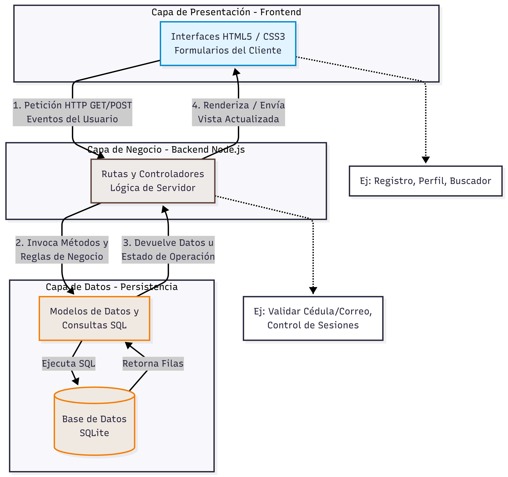
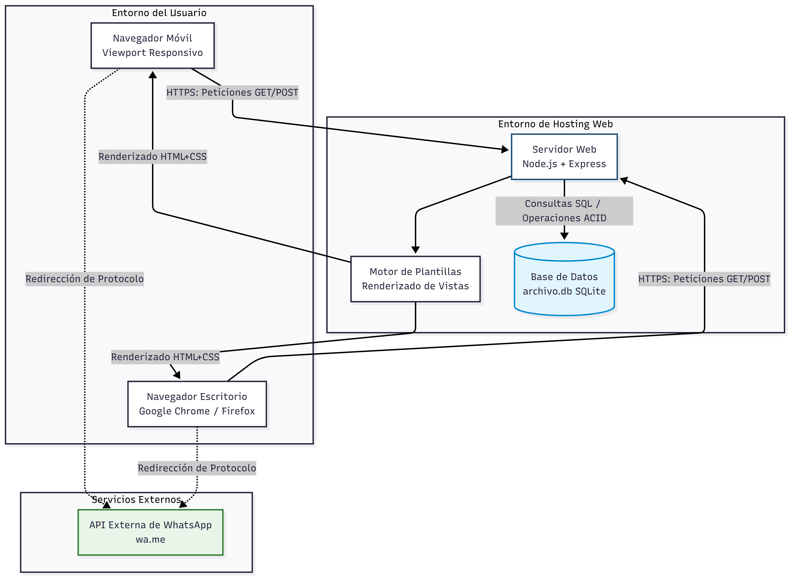
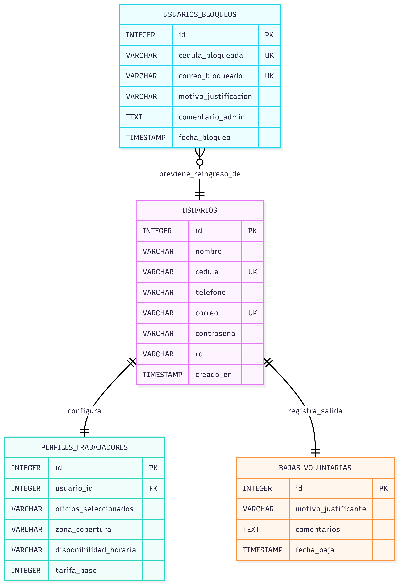
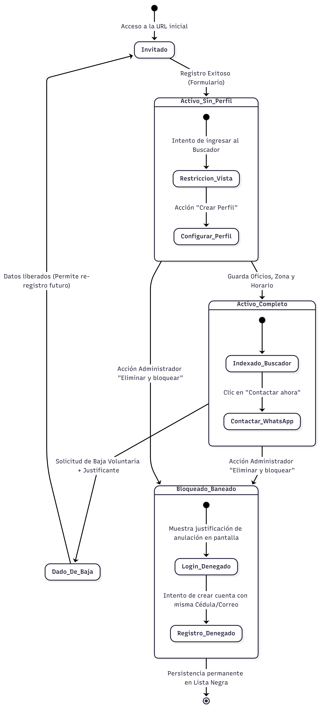
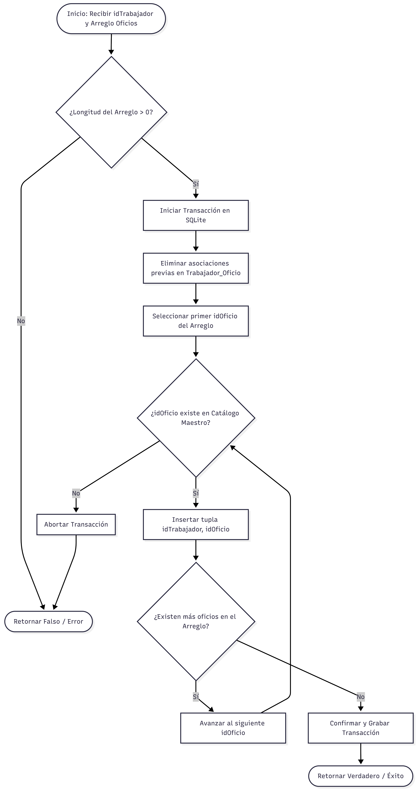
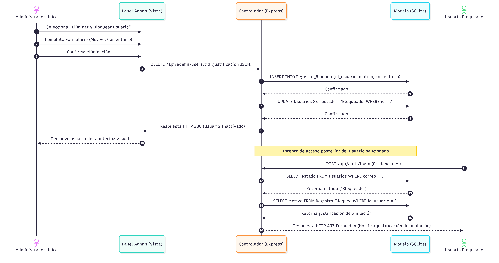
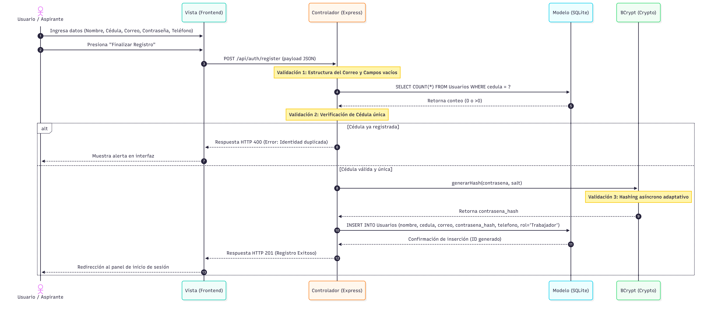

# Manual Técnico y Arquitectura del Sistema

Este documento define las especificaciones técnicas, decisiones de diseño de software y diagramas de ingeniería que componen la plataforma digital para la oferta y demanda de servicios profesionales en Colonias Unidas.

---

## 1. Diseño Arquitectónico (MVC)

La plataforma implementa el patrón de arquitectura **Modelo-Vista-Controlador (MVC)**, garantizando el desacoplamiento entre las interfaces de usuario (Vistas), las directivas de negocio (Controladores) y el motor de persistencia (Modelos).

### Capas del Ecosistema
* **Backend:** Desarrollado bajo el entorno de ejecución Node.js utilizando el framework Express para el manejo de middlewares, sesiones y el enrutamiento HTTP.
* **Persistencia:** Base de datos embebida SQLite3, manejada de manera relacional mediante sentencias SQL locales almacenadas en el archivo físico del servidor.
* **Frontend:** Interfaces construidas nativamente con HTML5, CSS3 y componentes JavaScript del lado del cliente.

---

## 2. Modelado de Datos y Estructura Relacional

El esquema relacional de la base de datos se encuentra estructurado en el archivo `schema.sql` y materializado en `plataforma_servicios.db`. Las relaciones atienden a reglas estrictas de integridad referencial, llaves primarias, foráneas y restricciones lógicas `UNIQUE`.

---

## 3. Comportamiento y Flujos Lógicos del Sistema

El comportamiento dinámico de los controladores y las rutas asíncronas del servidor Express se detallan mediante los siguientes diagramas técnicos:

### 3.1 Ciclo de Vida y Flujo de Control
El sistema procesa las solicitudes entrantes siguiendo un flujo secuencial controlado por middlewares de autenticación y validación de sesiones activas.

### 3.2 Diagramas de Secuencia Core
A continuación, se exponen las interacciones temporales de objetos del sistema para los dos escenarios críticos de la lógica del negocio:

* **Autenticación y Registro:** Paso de mensajes entre la Vista, el Controlador de Autenticación y el archivo de base de datos SQLite.
    

* **Búsqueda y Filtrado Dinámico:** Proceso de consulta asíncrona que extrae las tuplas de los profesionales según la zona e indexación requerida.
    

---

## 4. Gestión de Evidencias de Pruebas del Backend

Para certificar la correcta ejecución de las transacciones SQL, el control de errores, la gestión de la latencia en las consultas y los bloqueos lógicos del sistema, revise las capturas técnicas detalladas en el subdirectorio de evidencias:

* `latencia_index.png` / `latencia_buscador.png`: Pruebas de velocidad de respuesta del servidor ante peticiones HTTP simultáneas.
* `bloqueado.png` / `bloquear_cuenta.png`: Comportamiento del sistema ante intentos fallidos de intrusión o validación de perfiles incompletos.
* `datos_registrados.png` / `usuario_registrado.png`: Verificación del guardado físico de los datos en la base de datos en tiempo de desarrollo.