# Manual de Usuario y Operación del Sistema

Este documento describe de forma técnico-operativa los procedimientos y flujos lógicos que los usuarios finales (ciudadanos de Colonias Unidas) y administradores deben seguir para interactuar con las interfaces dinámicas de la plataforma digital de oferta y demanda de servicios profesionales.

---

## 1. Interfaz Principal y Búsqueda de Profesionales (CU-03)

Al ingresar a la plataforma, se presentará la pantalla de inicio. Los usuarios pueden utilizar la barra de búsqueda central para localizar profesionales por su área de especialidad.

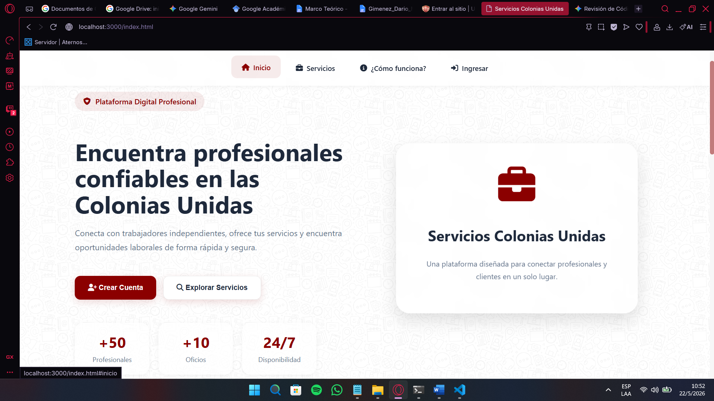

### Flujo de Consulta Dinámica
1. **Filtros Activos:** El demandante accede a la vista de búsqueda, la cual expone un menú de selección de oficios y zonas de Colonias Unidas (Hohenau, Obligado, Bella Vista).

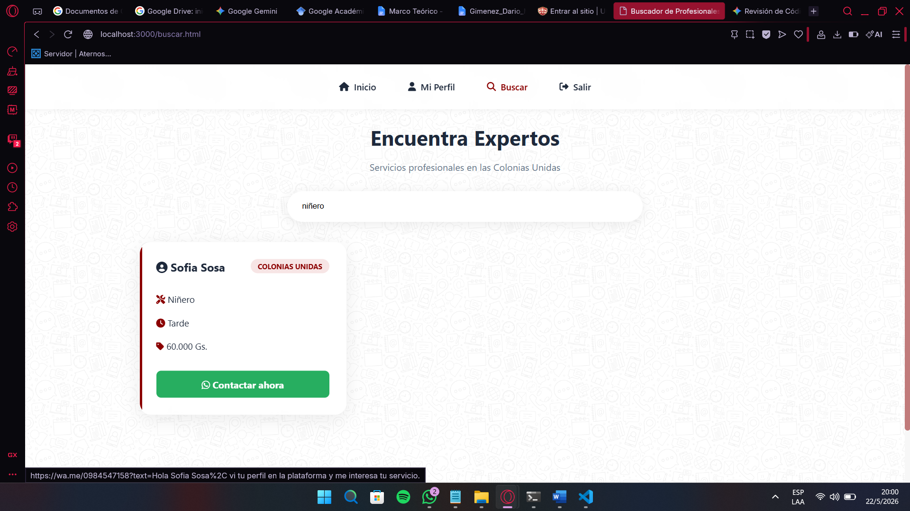

2. **Resultados Indexados:** El sistema renderiza las tarjetas de perfil que coincidan con el criterio exacto a partir de las consultas a la base de datos.

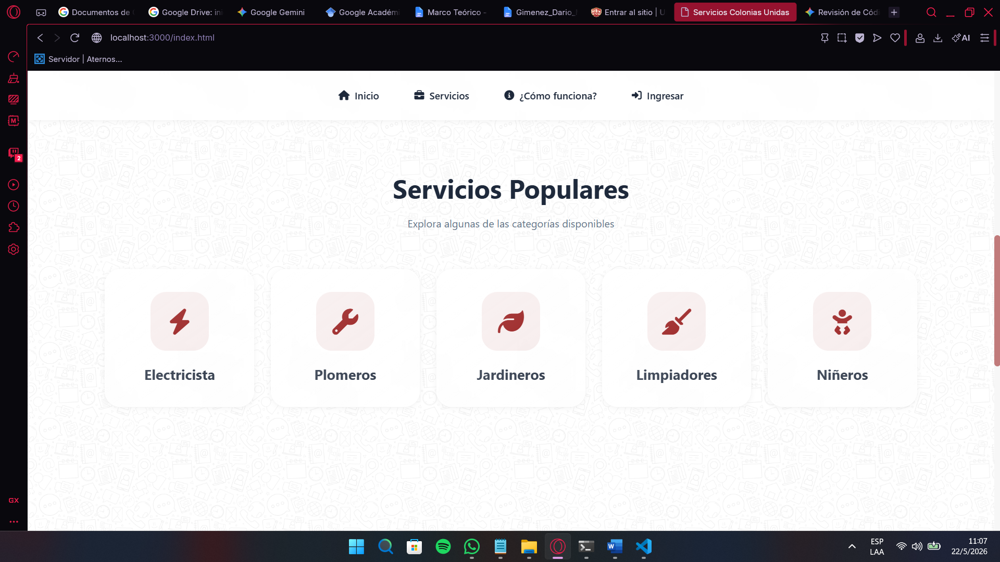

3. **Protocolo de Enlace Externo:** Al presionar el botón de contacto, el sistema invoca dinámicamente el protocolo de WhatsApp Web/Móvil para abrir un canal de comunicación directo y privado entre el cliente y el profesional.

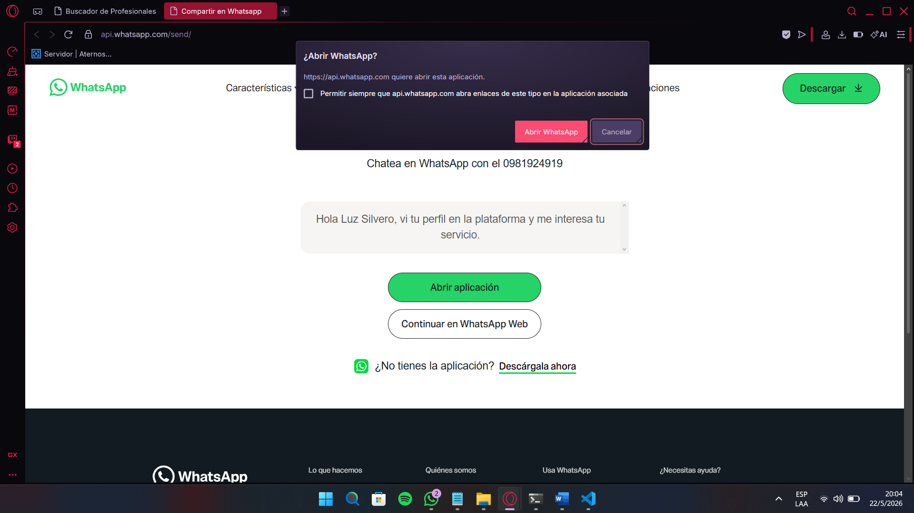

---

## 2. Gestión de Accesos y Autenticación (CU-01)

### 2.1 Restricción de Navegación Anónima
Para resguardar la seguridad de la plataforma y de los perfiles de los profesionales, el sistema cuenta con un control de acceso perimetral. Si un usuario intenta saltarse el flujo asíncrono o acceder directamente a la visualización detallada de los trabajadores sin haberse autenticado, el sistema interceptará la petición y desplegará una alerta restrictiva.

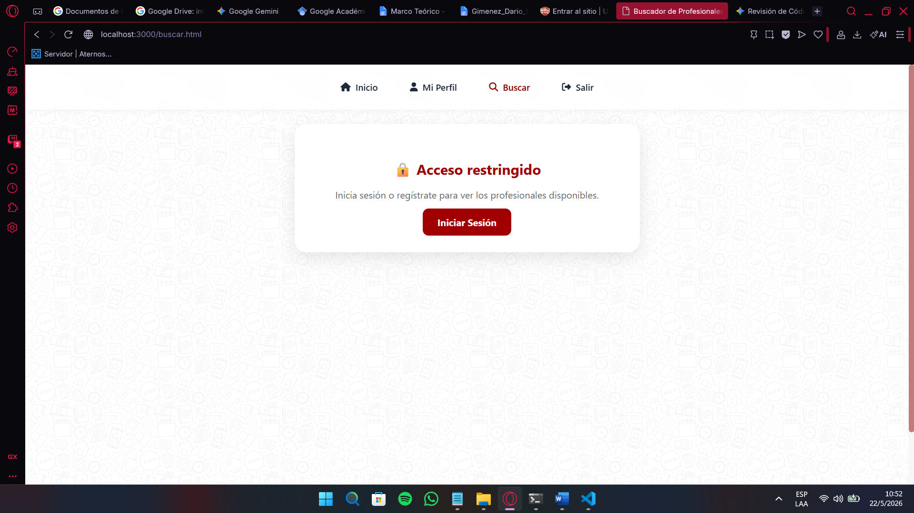

---

## 2. Gestión de Accesos y Autenticación (CU-01)

### 2.1 Restricción de Navegación Anónima
Para resguardar la seguridad de la plataforma y de los perfiles de los profesionales, el sistema cuenta con un control de acceso perimetral. Si un usuario intenta saltarse el flujo asíncrono o acceder directamente a la visualización detallada de los trabajadores sin haberse autenticado, el sistema interceptará la petición y desplegará una alerta restrictiva.

### 2.2 Registro de Nuevos Usuarios
Si no dispone de una cuenta activa para levantar las restricciones de visualización, puede registrarse completando el formulario con sus datos personales obligatorios: Nombre, Apellido, Correo Electrónico, Contraseña y Cédula de Identidad (C.I.).

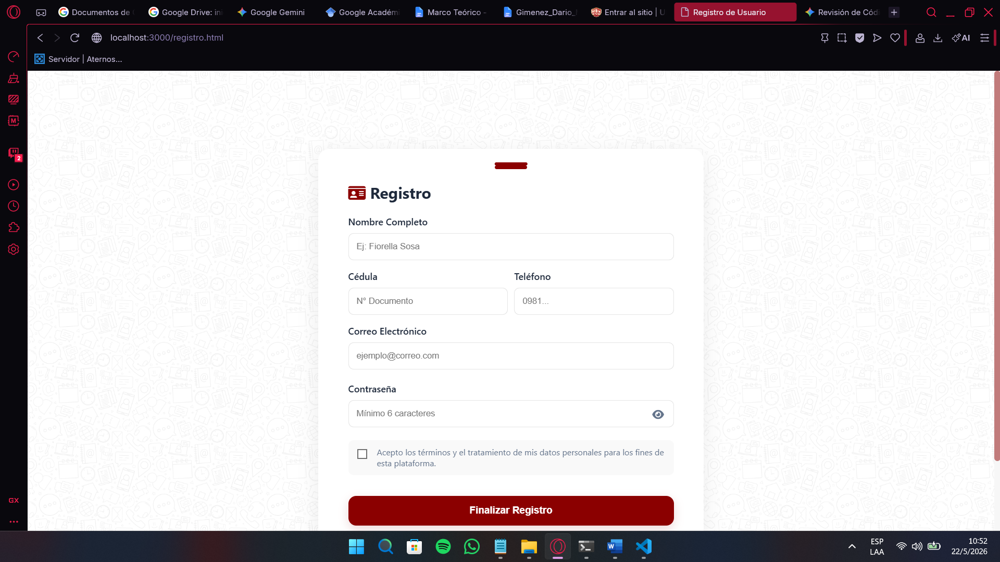

> **Nota de Seguridad y Unicidad de Datos:** El sistema valida rigurosamente las restricciones lógicas en el Backend antes de impactar la base de datos `db.sqlite`. Si un ciudadano intenta registrarse utilizando un número de Cédula de Identidad o un Correo Electrónico que ya existen en el sistema, la aplicación abortará la transacción y emitirá una alerta de bloqueo preventivo.

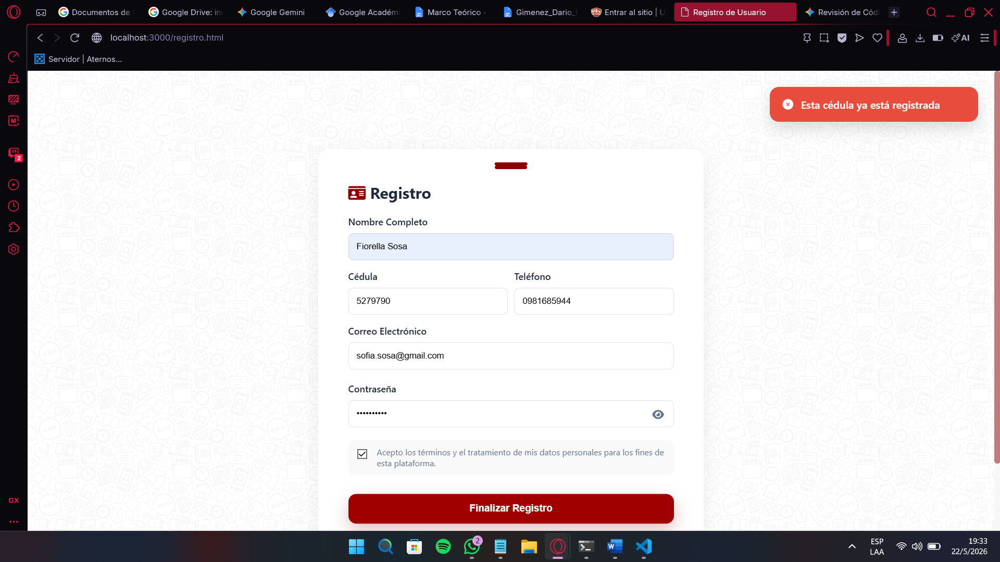

### 2.3 Inicio de Sesión
Para validar su identidad, levantar los bloqueos lógicos de búsqueda y acceder al panel de configuración, introduzca sus credenciales en el formulario de login.

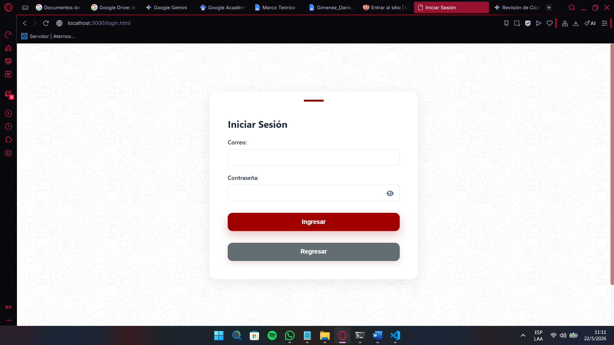

---

## 3. Control de Acceso y Configuración Obligatoria de Perfil (CU-02)

### Restricción del Middleware de Seguridad
Tras el primer inicio de sesión exitoso, el middleware interceptará la sesión activa. Si el usuario no ha completado los detalles de su oficio, se restringirá su acceso al ecosistema y se le obligará a parametrizar su perfil laboral.

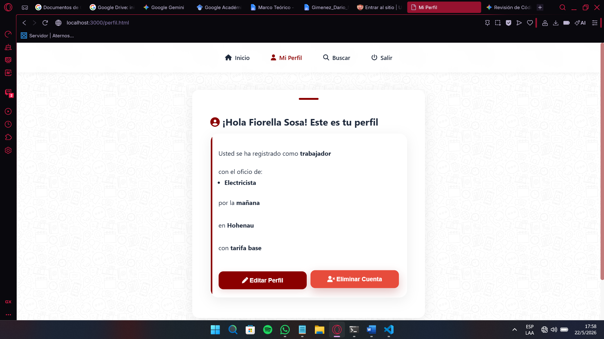

El usuario debe declarar de manera obligatoria:
* Oficios u especialidades laborales.
* Zonas geográficas de cobertura dentro de las Colonias Unidas.
* Rangos de disponibilidad temporal para atención al cliente.

---

## 4. Módulo de Administración del Sistema

Los usuarios con privileges de administración disponen de una interfaz exclusiva para monitorear el comportamiento global de la plataforma, gestionar las categorías del sistema y controlar las métricas operativas.

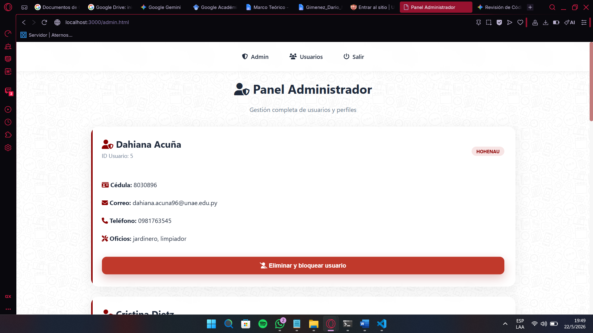

### Gestión de Seguridad y Control Operativo
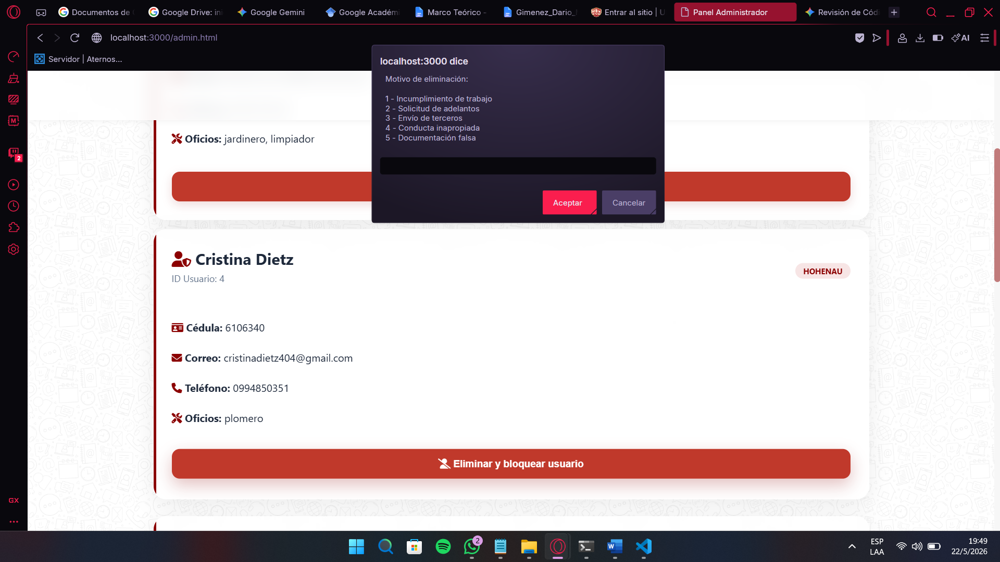
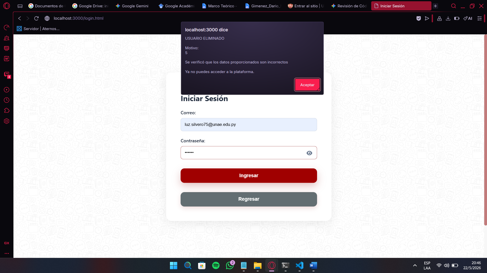

---

## 5. Baja Voluntaria y Desvinculación del Sistema (CU-04)

Flujo transaccional que permite al profesional revocar de forma autónoma la visibilidad de sus datos.

1. El profesional ingresa a la sección de configuración de su panel y selecciona la opción **"Eliminar mi cuenta"**.

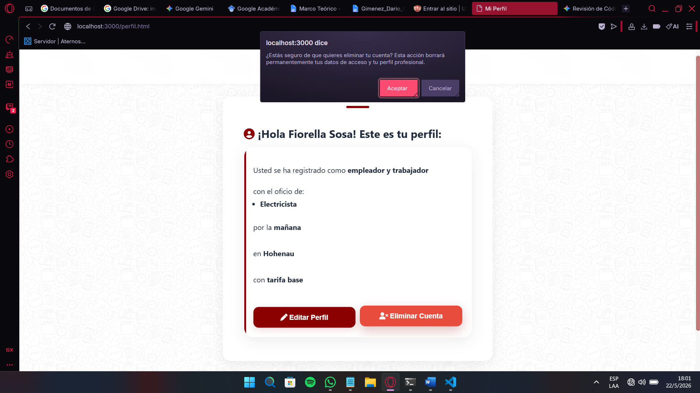

2. El sistema requiere una confirmación y la selección/redacción del motivo de su salida por cuestiones estadísticas.

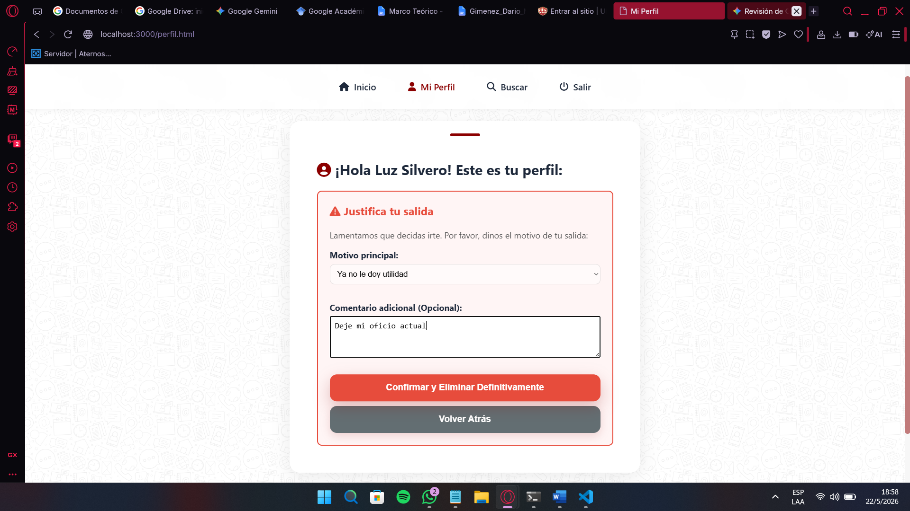

3. Al procesar la baja, el controlador purga el registro de la base de datos relacional, removiendo inmediatamente el perfil de los índices de búsqueda pública y liberando el número de cédula para futuros registros si fuesen necesarios.

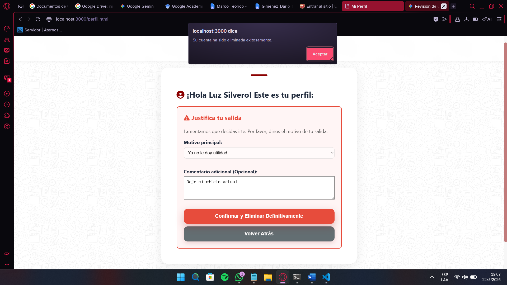